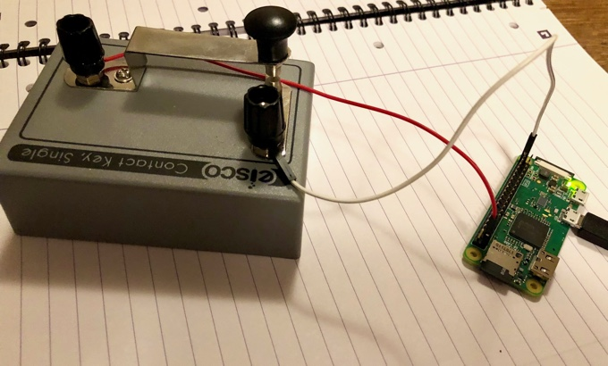

# Morsey

The plan is to wire up a Raspbery Pi Zero to a telegraph key, to decode Morse and send messages to Slack.

## Vague plan

- [x] Ensure we're building the firmware onto a Pi
- [x] `init_gadget` and ability to upload new firmware over 
- [x] Be able to send messages to a Slack channel from host
- [x] Wifi
- [x] Send messages to Slack from Pi
- [x] Send key down, key up to Slack channel
- [x] Send dots, dashes to slack channel
- [x] Distinguish letters
- [x] Distinguish words
- [x] Decode
- [ ] Change dot timings from Slack
- [ ] Bundle words into slack messages

## Morse

From https://en.wikipedia.org/wiki/Morse_code#/media/File:International_Morse_Code.svg


## Getting working

### OpenSSL gotcha

Note that when compiling Erlang you may need to ensure OpenSSL is installed and configured, or else you'll end up without `crypto` which is necessary for SSL connections to Slack. On a Mac with [Homebrew](https://brew.sh) 

1. `brew install openssl`
2. ensure `/usr/local/opt/openssl/bin` is on your path
3. `export LDFLAGS="-L/usr/local/opt/openssl/lib"`
4. `export CPPFLAGS="-I/usr/local/opt/openssl/include"`

(The last 3 points you can get with `brew info openssl`). You will need to do similar things on Linux.

### Building

1. [Install Nerves](https://hexdocs.pm/nerves/1.3.4/installation.html) 
2. [Create a Slack Bot Integration](https://my.slack.com/services/new/bot) (will require a Slack account.)
3. Create a `apps/slacking/config/secret.exs` contining your Slackbot's token. (Use `secret.example.exs`, in the same directory, as a template)
4. Create a `apps/wifi/config/config.secret.exs` and put your WiFi details in. (Use `config.secret.example.exs`, in the same directory, as a template)
5. `cd apps/fw`
6. `MIX_ENV=prod mix firmware`

(NB setting `MIX_ENV` to prod when building for a device is a thing I do.)

### Intalling

You'll need a Raspberry PI Zero W with headers. (Other PIs should work, as long as there's WiFi, but you will need to slightly change `apps/fw/mix.exs`), and a [Telegraph Key](https://en.wikipedia.org/wiki/Telegraph_key).

 Wire up one end of the key to the +3V pin on the Pi Zero, the pin nearest the SD card; wire up pin 21 (the most opposite pin at the other end of the header, and furthest from the camera port.). Alternatively choose a pin other than 21, by changing `apps/telegraph/config.exs`.

 [Burn your SD card](https://hexdocs.pm/nerves/1.3.4/getting-started.html#building-and-deploying-firmware) from `apps/fw` with

 ```
 MIX_ENV=prod mix firmware.burn
 ```

 Then you should be good to go. It can take a minute to get onto WiFi and set the time.

 ### Troubleshooting

 Use [Picocom](https://github.com/npat-efault/picocom) or [Screen](https://www.gnu.org/software/screen/manual/screen.html) to connect to the Pi over a data micro-usb cable. Ensure the cable is connected to the furthest usb port from the SD card, on the PI. 
 
 On a Mac type `screen /dev/tty.usb` and tab complete. When connected you can type `RingLogger.attach` and see what's happening.

### Piccy

